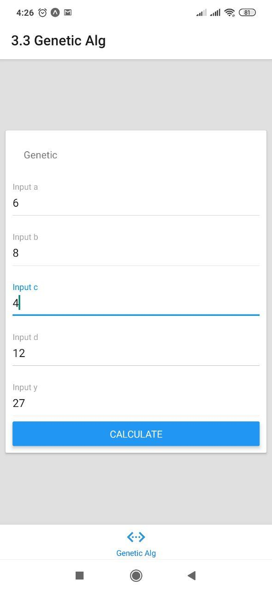
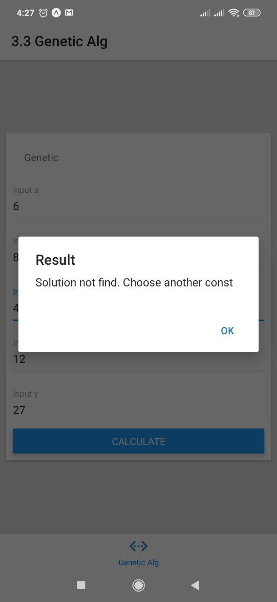
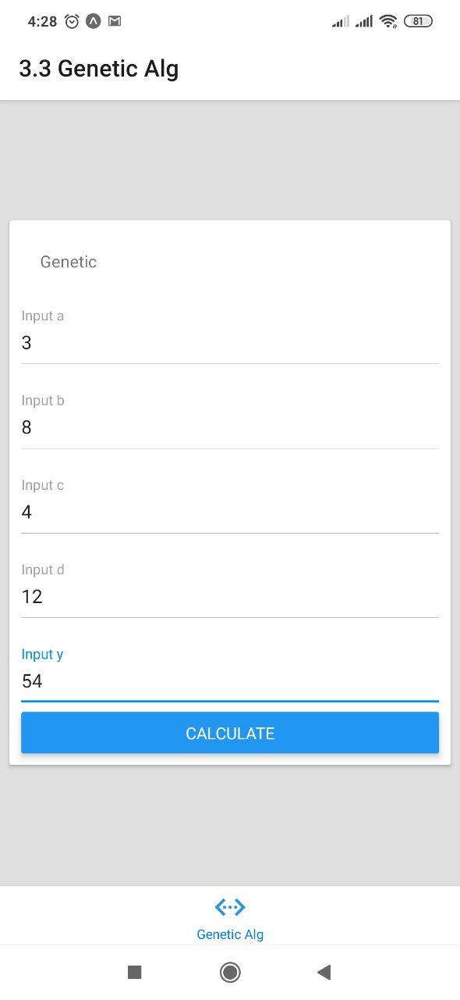
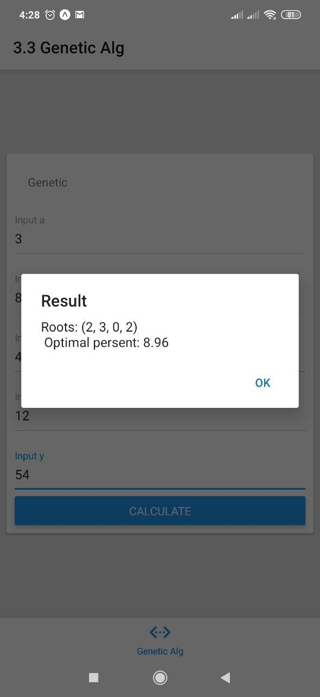

# Real Time Systems Laboratory work №3.3
## Made by IV-72 Vasyl Bortnik 7203
#### Main program is in Source dir, in a file named "Genetic.js"

## How to use

1. Download project and open a cmd in the directory of it
2. Install JC dependencies via $yarn
3. Run the app via `$ yarn start` or `$ npm start`

##Code
```javascript
//Some math functions for help
const getRandomFloat = (min, max) => Math.random() * max + min;
const getRandomInt = (min, max) => Math.floor(Math.random() * (max + 1) + min);
const Array2D = (N, M) =>
    Array(N)
        .fill(0)
        .map(_ => Array(M).fill(0));


const makeChromosome = ({ GENES_COUNT, GENE_MIN, GENE_MAX }) => {
    const MUTATION_LIKELIHOOD = 5.0;

    const makeChromosomeHelper = () => {
        let genes = Array(GENES_COUNT).fill(0);
        let fitness = 0;
        let likelihood = 0;
        const getGenes = () => genes;

        const getRandomCrossoverLine = () => getRandomInt(0, GENES_COUNT - 2);
        const cloneChromosome = ({ fitness, likelihood, genes }) => {
            const result = makeChromosomeHelper();
            result.setFitness(fitness);
            result.setLikelihood(likelihood);
            result.setGenes(genes);
            return result;
        };

        const doubleCrossover = (chromosome) => {
            const crossoverline = getRandomCrossoverLine(GENES_COUNT);
            const result = [makeChromosomeHelper(), makeChromosomeHelper()];

            for (let i = 0; i < GENES_COUNT; ++i) {
                if (i <= crossoverline) {
                    result[0].getGenes()[i] = getGenes()[i];
                    result[1].getGenes()[i] = chromosome.getGenes()[i];
                } else {
                    result[0].getGenes()[i] = chromosome.getGenes()[i];
                    result[1].getGenes()[i] = getGenes()[i];
                }
            }
            return result;
        };

        return {
            getFitness: () => fitness,
            setFitness: (_fitness) => (fitness = _fitness),
            getGenes,
            setGenes: (_genes) => (genes = _genes),
            getLikelihood: () => likelihood,
            setLikelihood: (_likelihood) => (likelihood = _likelihood),
            calculateFitness: ({ a, b, c, d, y }) => {
                const [x1, x2, x3, x4] = genes;
                const closeness = Math.abs(y - (x1 * a + x2 * b + x3 * c + x4 * d));
                return closeness === 0 ? -1 : closeness;
            },
            mutateWithGivenLikelihood: () => {
                const result = cloneChromosome({ fitness, likelihood, genes });
                for (let i = 0; i < GENES_COUNT; ++i) {
                    const randomPercent = getRandomFloat(0, 100);
                    randomPercent < MUTATION_LIKELIHOOD &&
                        (result.getGenes()[i] = getRandomInt(GENE_MIN, GENE_MAX));
                }
                return result;
            },
            singleCrossover: (chromosome) => {
                const children = doubleCrossover(chromosome);
                const childNumber = getRandomInt(0, 1);
                return children[childNumber];
            },
            toString: () => {
                let result = "Roots: (";
                for (let i = 0; i < GENES_COUNT; ++i) {
                    result += `${genes[i]}${i < GENES_COUNT - 1 ? ", " : ""}`;
                }
                result += ")\n";
                return result;
            },
        };
    };
    return makeChromosomeHelper();
};

const TARGET_IS_REACHED_FLAG = -1;
const TARGET_NOT_REACHED_FLAG = -2;
const POPULATION_COUNT = 5;
const GENES_COUNT = 4;
const GENE_MIN = 0;
let GENE_MAX;
const MAX_ITERATIONS = 10000;

//Set max number that gene can be depending on y
const setGeneMax = (y) => {
  GENE_MAX = y >= 10 ? Math.floor(y / 10) : y;
};

let population = new Array(POPULATION_COUNT);

const getRandomGene = () => getRandomInt(GENE_MIN, GENE_MAX);

//Filling our population with genes
const createInitialPopulation = () => {
  for (let i = 0; i < POPULATION_COUNT; ++i) {
    population[i] = makeChromosome({ GENES_COUNT, GENE_MIN, GENE_MAX });
    population[i].getGenes()[i] = getRandomGene();
  }
};
const setPopulation = (_population) => (population = _population);

//Calculating fitnes
const fillChromosomesWithFitnesses = (coeffs) => {
  for (let i = 0; i < POPULATION_COUNT; ++i) {
    const currentFitness = population[i].calculateFitness(coeffs);
    population[i].setFitness(currentFitness);
    if (currentFitness === TARGET_IS_REACHED_FLAG) return i;
  }
  return TARGET_NOT_REACHED_FLAG;
};
const getAllFitnessesSum = () => {
  let allFitnessesSum = 0;
  for (let i = 0; i < POPULATION_COUNT; ++i)
    allFitnessesSum += population[i].getFitness();

  return allFitnessesSum;
};

//Calc of how likely chroms will be a pair
const fillChromosomeWithLikelihoods = () => {
  const allFitnessesSum = getAllFitnessesSum();
  let last = 0;
  let i;
  for (i = 0; i < POPULATION_COUNT; ++i) {
    const likelihood =
      last + (100 * population[i].getFitness()) / allFitnessesSum;
    last = likelihood;
    population[i].setLikelihood(likelihood);
  }
};

//Helping func
const getChromosomeNumberForThisRand = (rand) => {
  let i;
  for (i = 0; i < POPULATION_COUNT; ++i) {
    if (rand <= population[i].getLikelihood()) {
      return i;
    }
  }
  return i - 1;
};

//Randomly choosing 2 Chromosoms for crossover
const getPairsForCrossover = () => {
  const pairs = Array2D(POPULATION_COUNT, 2);
  let rand = getRandomFloat(0, 100);

  for (let i = 0; i < POPULATION_COUNT; ++i) {
    rand = getRandomFloat(0, 100);
    const firstChromosome = getChromosomeNumberForThisRand(rand);
    let secondChromosome;
    do {
      rand = getRandomFloat(0, 100);
      secondChromosome = getChromosomeNumberForThisRand(rand);
    } while (firstChromosome === secondChromosome);

    pairs[i][0] = firstChromosome;
    pairs[i][1] = secondChromosome;
  }

  return [pairs, rand];
};

//perform crossover; mutation for population; GetNextGeneration
const getNextGeneration = (pairs) => {
  const nextGeneration = new Array(POPULATION_COUNT);
  for (let i = 0; i < POPULATION_COUNT; ++i) {
    const firstParent = population[pairs[i][0]];
    const secondParent = population[pairs[i][1]];
    const result = firstParent.singleCrossover(secondParent);
    nextGeneration[i] = result.mutateWithGivenLikelihood();
  }
  return nextGeneration;
};

//Main function which are called from Screens
export const calcGenetic = (coeffs) => {
  let optimalPercent = 0;
  setGeneMax(coeffs.y);
  createInitialPopulation();
  for (let iters = 0; iters < MAX_ITERATIONS; iters++) {
    const ind = fillChromosomesWithFitnesses(coeffs);

    if (ind != TARGET_NOT_REACHED_FLAG) {
      return [
        `${population[
          ind
        ].toString()} Optimal persent: ${optimalPercent.toFixed(2)}`,
        "",
      ];
    }

    fillChromosomeWithLikelihoods();
    const [pairs, percent] = getPairsForCrossover();
    optimalPercent = percent;
    const nextGeneration = getNextGeneration(pairs);
    setPopulation(nextGeneration);
  }
    return ["", "Solution not find. Choose another const"];
};

console.log();
```

## Examples





